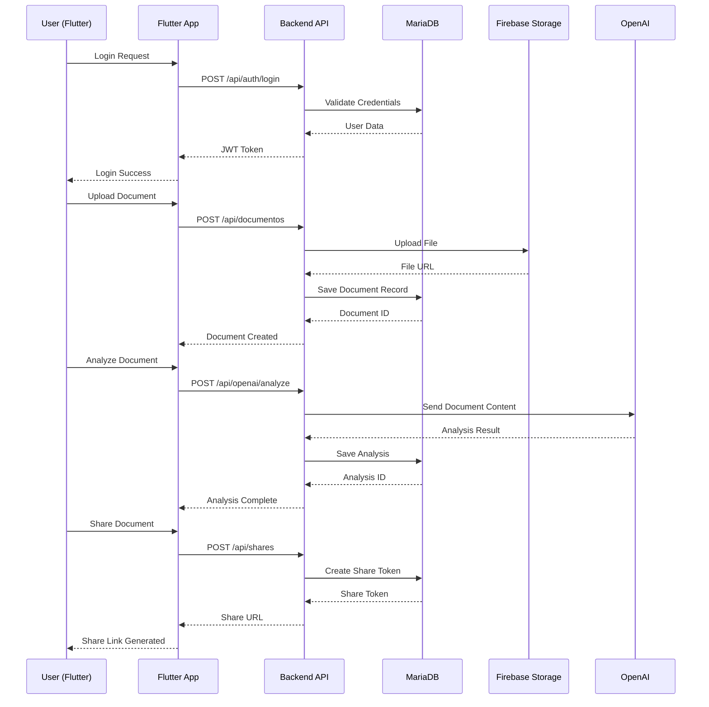

# 🏗️ Arquitetura do Sistema DocVita

Este documento contém os diagramas da arquitetura do backend e frontend do sistema DocVita.

## Backend Architecture (Node.js/Express)

```mermaid
graph TB
    subgraph "Client Layer"
        WEB[Web App<br/>Flutter Web]
        MOBILE[Mobile App<br/>Flutter]
        API_CLIENT[API Clients]
    end

    subgraph "API Gateway Layer"
        EXPRESS[Express Server<br/>Port 3200]
        CORS[CORS Middleware]
        HELMET[Security Middleware]
        MORGAN[Logging Middleware]
    end

    subgraph "Authentication Layer"
        JWT[JWT Authentication]
        FIREBASE_AUTH[Firebase Auth]
        AUTH_MIDDLEWARE[Auth Middleware]
    end

    subgraph "Route Layer"
        AUTH_ROUTES[/api/auth]
        USER_ROUTES[/api/users]
        DOC_ROUTES[/api/documentos]
        EXAM_ROUTES[/api/exames]
        MED_ROUTES[/api/medicamentos]
        PLAN_ROUTES[/api/plans]
        PAYMENT_ROUTES[/api/payments]
        SHARE_ROUTES[/api/shares]
        PROXY_ROUTES[/proxy]
    end

    subgraph "Controller Layer"
        AUTH_CTRL[Auth Controller]
        USER_CTRL[User Controller]
        DOC_CTRL[Document Controller]
        EXAM_CTRL[Exam Controller]
        MED_CTRL[Medicine Controller]
        PLAN_CTRL[Plan Controller]
        PAYMENT_CTRL[Payment Controller]
        SHARE_CTRL[Share Controller]
        PROXY_CTRL[File Proxy Controller]
    end

    subgraph "Service Layer"
        DOC_SERVICE[Document Service]
        PAYMENT_SERVICE[Payment Service]
        PLAN_SERVICE[Plan Service]
        SHARE_SERVICE[Share Service]
        UPLOAD_SERVICE[Upload Service]
        HEALTH_SERVICE[Health Card Service]
    end

    subgraph "Payment Providers"
        ASAAS[Asaas Provider]
        STRIPE[Stripe Provider]
        PAYMENT_FACTORY[Payment Factory]
    end

    subgraph "AI Services"
        OPENAI[OpenAI Integration]
        ANALYZE[Document Analysis]
        PREFILL[Form Prefill]
    end

    subgraph "Data Layer"
        MARIADB[(MariaDB<br/>Database)]
        FIREBASE_STORAGE[(Firebase Storage)]
        FILE_SYSTEM[File System]
    end

    subgraph "External Services"
        FIREBASE[Firebase Services]
        WEBHOOK[Webhook Handlers]
        NOTIFICATIONS[Notification Service]
    end

    %% Connections
    WEB --> EXPRESS
    MOBILE --> EXPRESS
    API_CLIENT --> EXPRESS

    EXPRESS --> CORS
    EXPRESS --> HELMET
    EXPRESS --> MORGAN

    EXPRESS --> AUTH_ROUTES
    EXPRESS --> USER_ROUTES
    EXPRESS --> DOC_ROUTES
    EXPRESS --> EXAM_ROUTES
    EXPRESS --> MED_ROUTES
    EXPRESS --> PLAN_ROUTES
    EXPRESS --> PAYMENT_ROUTES
    EXPRESS --> SHARE_ROUTES
    EXPRESS --> PROXY_ROUTES

    AUTH_ROUTES --> AUTH_CTRL
    USER_ROUTES --> USER_CTRL
    DOC_ROUTES --> DOC_CTRL
    EXAM_ROUTES --> EXAM_CTRL
    MED_ROUTES --> MED_CTRL
    PLAN_ROUTES --> PLAN_CTRL
    PAYMENT_ROUTES --> PAYMENT_CTRL
    SHARE_ROUTES --> SHARE_CTRL
    PROXY_ROUTES --> PROXY_CTRL

    AUTH_CTRL --> JWT
    AUTH_CTRL --> FIREBASE_AUTH

    DOC_CTRL --> DOC_SERVICE
    PAYMENT_CTRL --> PAYMENT_SERVICE
    PLAN_CTRL --> PLAN_SERVICE
    SHARE_CTRL --> SHARE_SERVICE

    PAYMENT_SERVICE --> PAYMENT_FACTORY
    PAYMENT_FACTORY --> ASAAS
    PAYMENT_FACTORY --> STRIPE

    DOC_SERVICE --> OPENAI
    OPENAI --> ANALYZE
    OPENAI --> PREFILL

    DOC_SERVICE --> MARIADB
    PLAN_SERVICE --> MARIADB
    PAYMENT_SERVICE --> MARIADB
    SHARE_SERVICE --> MARIADB

    DOC_SERVICE --> FIREBASE_STORAGE
    UPLOAD_SERVICE --> FIREBASE_STORAGE
    UPLOAD_SERVICE --> FILE_SYSTEM

    EXPRESS --> FIREBASE
    EXPRESS --> WEBHOOK
    EXPRESS --> NOTIFICATIONS
```

## Frontend Architecture (Flutter)

```mermaid
graph TB
    subgraph "Presentation Layer"
        MAIN[main.dart<br/>App Entry Point]
        ROUTES[Routes Configuration]
        THEME[Theme Configuration]
    end

    subgraph "Core Layer"
        SERVICES[Core Services]
        MODELS[Core Models]
        WIDGETS[Core Widgets]
        MIXINS[Core Mixins]
    end

    subgraph "Feature Modules"
        AUTH_FEATURE[Auth Feature]
        DOCS_FEATURE[Documents Feature]
        EXAMS_FEATURE[Exams Feature]
        MEDS_FEATURE[Medicines Feature]
        PLANS_FEATURE[Plans Feature]
        PROFILE_FEATURE[Profile Feature]
        VACCINES_FEATURE[Vaccines Feature]
        WEB_FEATURE[Web Landing]
    end

    subgraph "Feature Structure"
        UI[UI Layer]
        DATA[Data Layer]
        DOMAIN[Domain Layer]
    end

    subgraph "Core Services"
        API_SERVICE[API Service]
        AUTH_SERVICE[Auth Service]
        FILE_SERVICE[File Service]
        NOTIFICATION_SERVICE[Notification Service]
        SESSION_SERVICE[Session Service]
        BIOMETRIC_SERVICE[Biometric Service]
    end

    subgraph "External Integrations"
        FIREBASE[Firebase SDK]
        GOOGLE_SIGNIN[Google Sign-In]
        ML_KIT[ML Kit OCR]
        PDF_VIEWER[PDF Viewer]
        IMAGE_PICKER[Image Picker]
        FILE_PICKER[File Picker]
    end

    subgraph "State Management"
        PROVIDER[Provider Pattern]
        SESSION_MANAGER[Session Manager]
        PLAN_LIMITER[Plan Limiter]
    end

    subgraph "Platform Support"
        WEB[Web Platform]
        ANDROID[Android Platform]
        IOS[iOS Platform]
    end

    %% Connections
    MAIN --> ROUTES
    MAIN --> THEME
    MAIN --> SERVICES

    SERVICES --> API_SERVICE
    SERVICES --> AUTH_SERVICE
    SERVICES --> FILE_SERVICE
    SERVICES --> NOTIFICATION_SERVICE
    SERVICES --> SESSION_SERVICE
    SERVICES --> BIOMETRIC_SERVICE

    AUTH_FEATURE --> UI
    AUTH_FEATURE --> DATA
    AUTH_FEATURE --> DOMAIN

    DOCS_FEATURE --> UI
    DOCS_FEATURE --> DATA
    DOCS_FEATURE --> DOMAIN

    EXAMS_FEATURE --> UI
    EXAMS_FEATURE --> DATA
    EXAMS_FEATURE --> DOMAIN

    MEDS_FEATURE --> UI
    MEDS_FEATURE --> DATA
    MEDS_FEATURE --> DOMAIN

    PLANS_FEATURE --> UI
    PLANS_FEATURE --> DATA
    PLANS_FEATURE --> DOMAIN

    PROFILE_FEATURE --> UI
    PROFILE_FEATURE --> DATA
    PROFILE_FEATURE --> DOMAIN

    VACCINES_FEATURE --> UI
    VACCINES_FEATURE --> DATA
    VACCINES_FEATURE --> DOMAIN

    WEB_FEATURE --> UI
    WEB_FEATURE --> DATA
    WEB_FEATURE --> DOMAIN

    API_SERVICE --> FIREBASE
    AUTH_SERVICE --> GOOGLE_SIGNIN
    FILE_SERVICE --> ML_KIT
    FILE_SERVICE --> PDF_VIEWER
    FILE_SERVICE --> IMAGE_PICKER
    FILE_SERVICE --> FILE_PICKER

    SERVICES --> PROVIDER
    SERVICES --> SESSION_MANAGER
    SERVICES --> PLAN_LIMITER

    MAIN --> WEB
    MAIN --> ANDROID
    MAIN --> IOS
```



## Data Flow Sequence



## 📋 Arquitetura Resumida

### Backend (Node.js/Express)
- **Padrão**: MVC com camadas bem definidas
- **Banco**: MariaDB com pool de conexões
- **Auth**: JWT + Firebase Auth
- **Pagamentos**: Asaas e Stripe
- **IA**: OpenAI para análise de documentos
- **Storage**: Firebase Storage + sistema local

### Frontend (Flutter)
- **Padrão**: Feature-based com Clean Architecture
- **Estado**: Provider pattern
- **Plataformas**: Web, Android, iOS
- **Integrações**: Firebase, Google Sign-In, ML Kit

### Principais Características
1. **Sistema de Planos**: Limites por plano
2. **Compartilhamento**: Tokens únicos para documentos
3. **IA**: Análise automática de documentos médicos
4. **Multi-plataforma**: Web e mobile
5. **Pagamentos**: Múltiplos provedores
6. **Segurança**: Autenticação robusta
