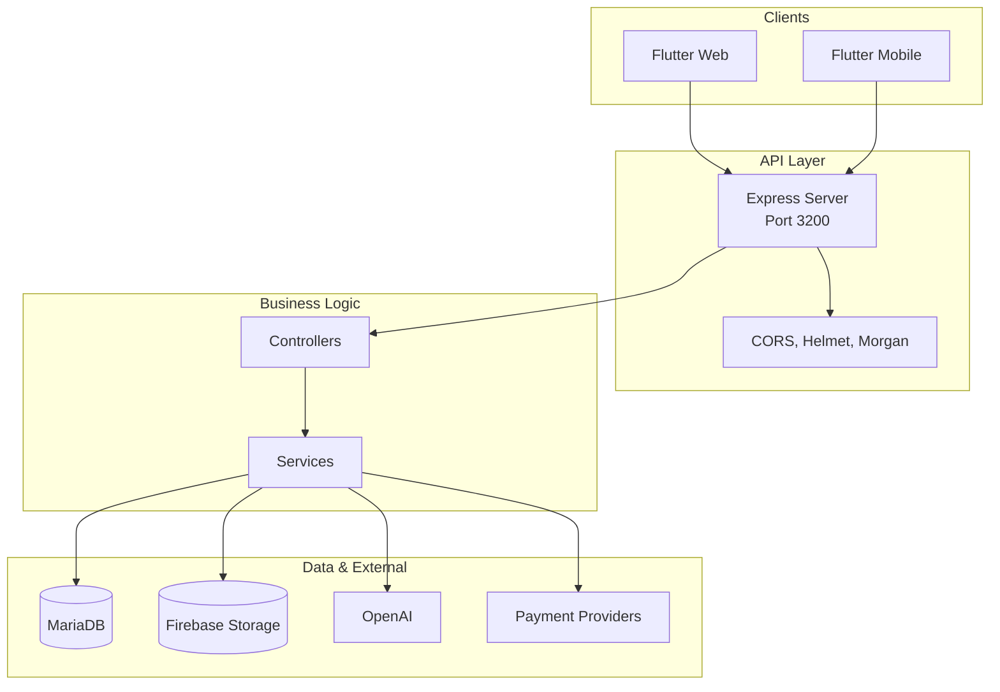
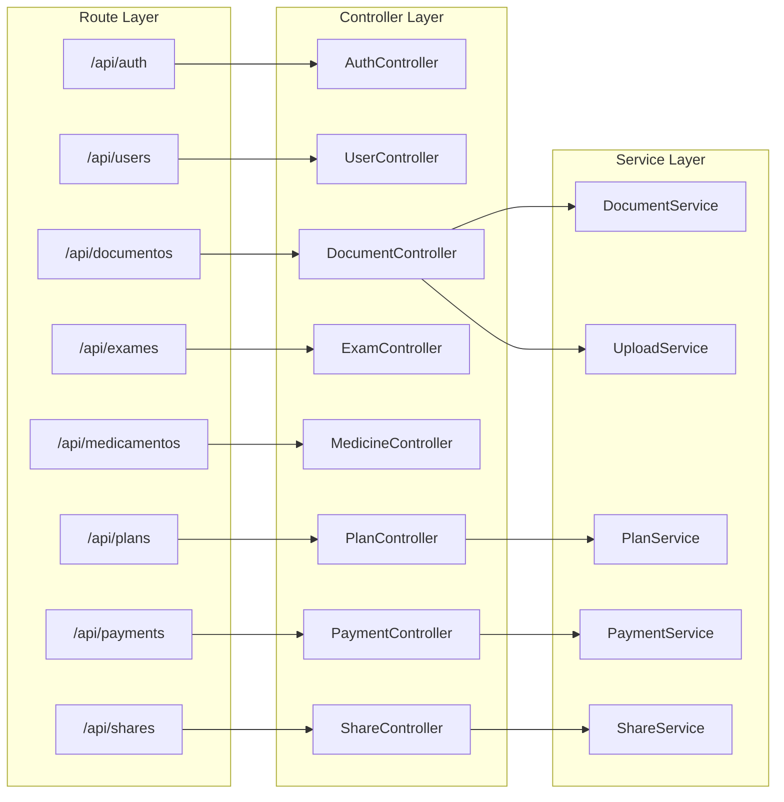
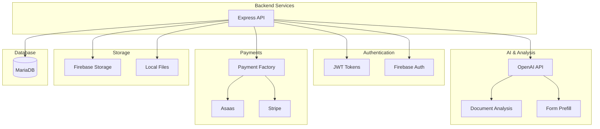
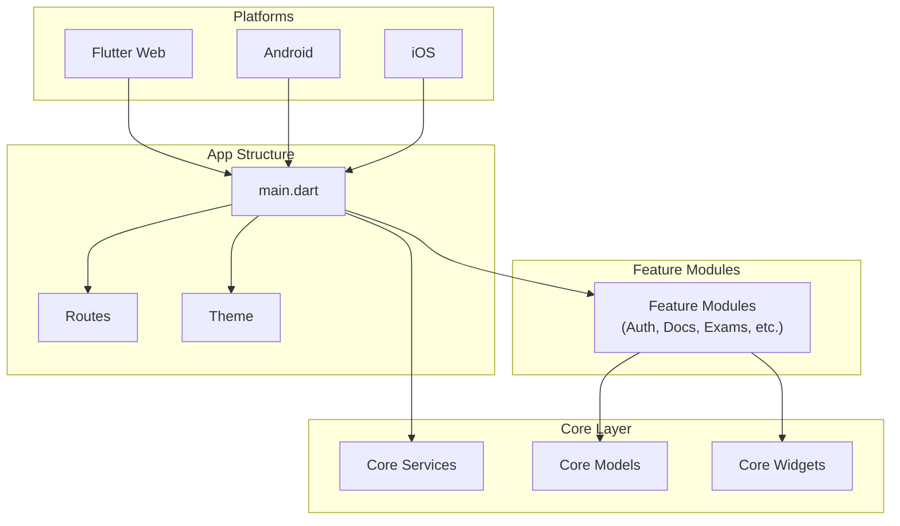
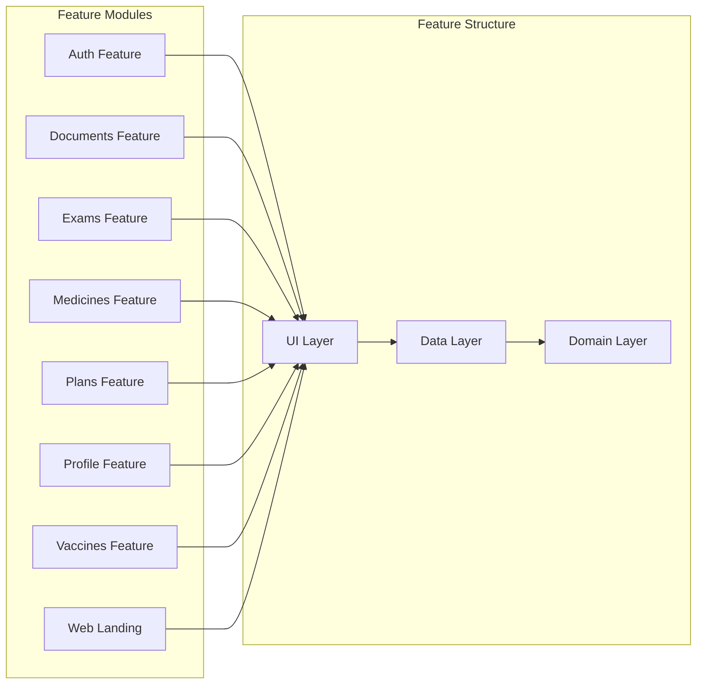
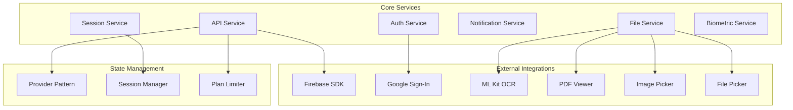
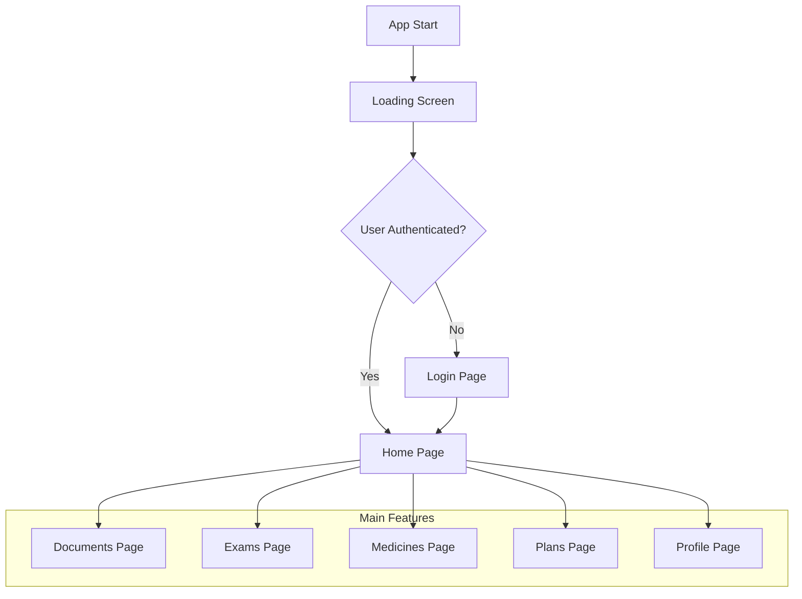
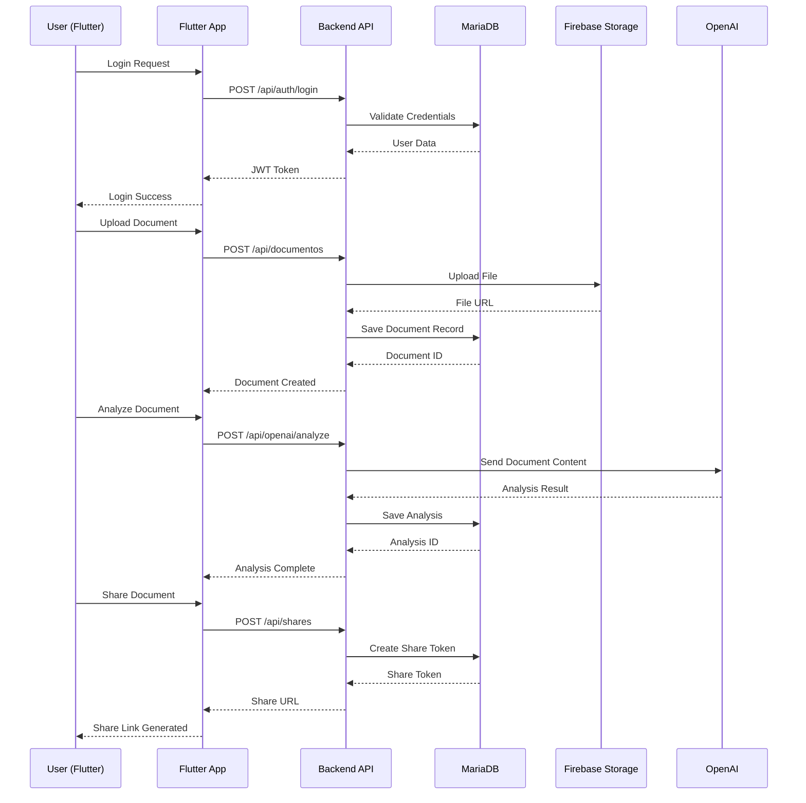

# 🏗️ Arquitetura do Sistema DocVita

Este documento contém os diagramas da arquitetura do backend e frontend do sistema DocVita.

## Backend Architecture (Node.js/Express)

### Visão Geral da Arquitetura

### Detalhamento das Camadas

### Integrações Externas

## Frontend Architecture (Flutter)

### Visão Geral da Arquitetura

### Estrutura dos Features

### Core Services e Integrações

### Fluxo de Navegação

## Data Flow Sequence

## 📋 Arquitetura Resumida

### Backend (Node.js/Express)
- **Padrão**: MVC com camadas bem definidas
- **Banco**: MariaDB com pool de conexões
- **Auth**: JWT + Firebase Auth
- **Pagamentos**: Asaas e Stripe
- **IA**: OpenAI para análise de documentos
- **Storage**: Firebase Storage + sistema local

### Frontend (Flutter)
- **Padrão**: Feature-based com Clean Architecture
- **Estado**: Provider pattern
- **Plataformas**: Web, Android, iOS
- **Integrações**: Firebase, Google Sign-In, ML Kit

### Principais Características
1. **Sistema de Planos**: Limites por plano
2. **Compartilhamento**: Tokens únicos para documentos
3. **IA**: Análise automática de documentos médicos
4. **Multi-plataforma**: Web e mobile
5. **Pagamentos**: Múltiplos provedores
6. **Segurança**: Autenticação robusta
